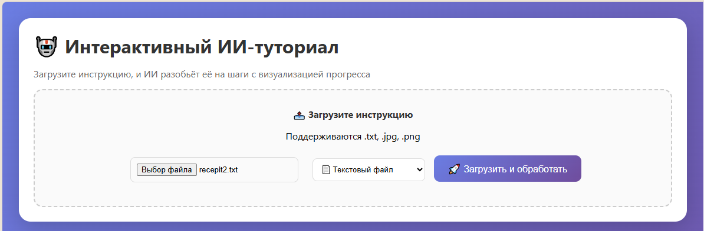
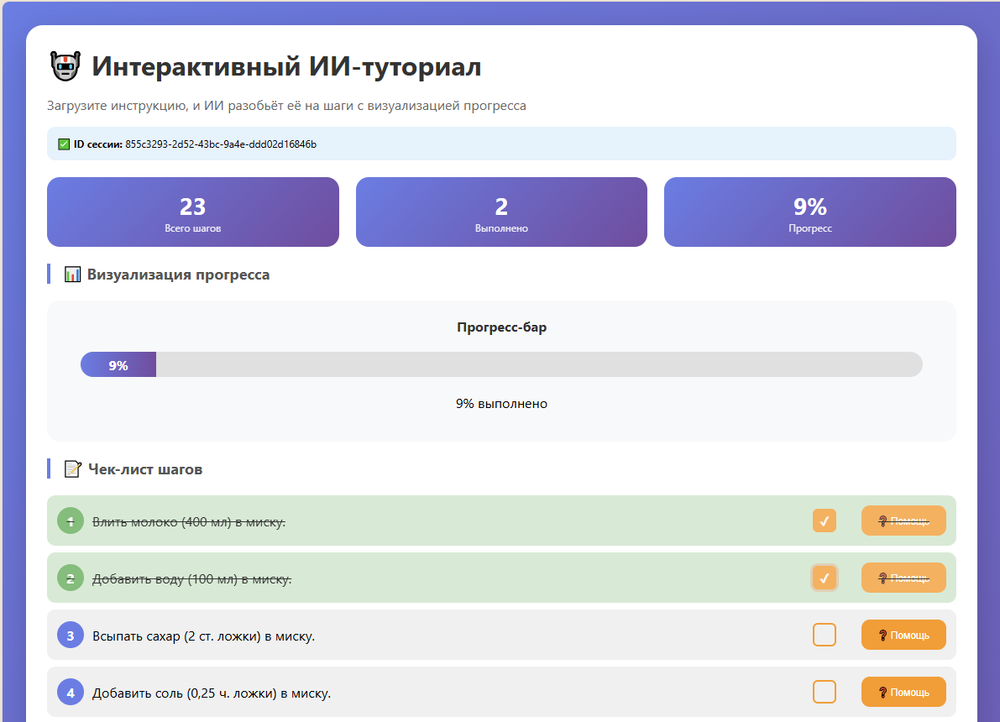
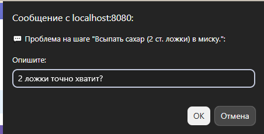
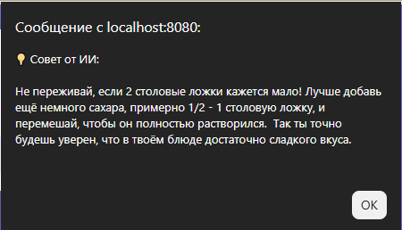
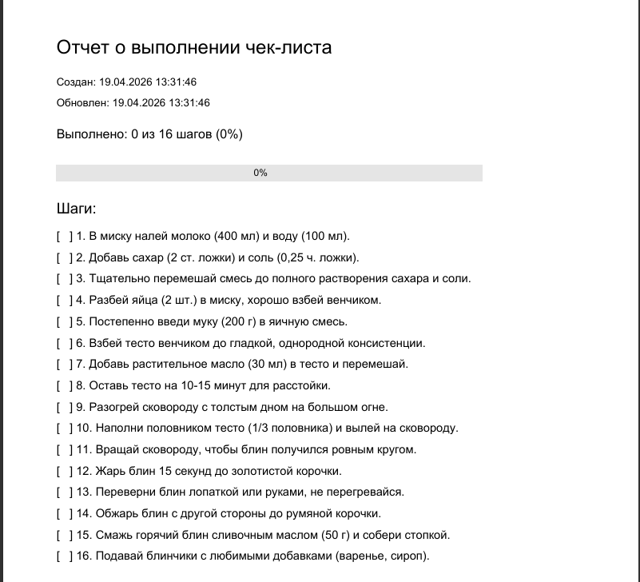

## Автор

Курылева Анастасия Александровна

Группа: 30321

# Техническое описание курсового проекта

## Интерактивный ИИ-туториал

**Описание проекта**

Веб-приложение для превращения текстовых инструкций в интерактивный пошаговый чек-лист с ИИ-помощником на базе Ollama.

---

## 1. Архитектура приложения

### 1.1 Общая архитектура

Приложение построено по трехуровневой архитектуре:

| Уровень | Компоненты |
|---------|------------|
| **Клиентский уровень** | HTML/CSS/JavaScript (браузер) |
| **Серверный уровень** | Spring Boot (Java 21) |
| **Уровень данных** | Файловая система (JSON) + внешние сервисы (Ollama, Tesseract) |

### 1.2 Компоненты серверной части

| Компонент | Назначение |
|-----------|------------|
| **TutorialController** | Обработка HTTP-запросов, координация сервисов |
| **AiService** | Взаимодействие с Ollama (разбивка на шаги, советы) |
| **OcrService** | Распознавание текста с изображений (Tesseract) |
| **PdfExportService** | Генерация PDF-отчетов (PDFBox) |
| **FileStorageService** | Сохранение/загрузка сессий в JSON |
| **SessionRepository** | Кэширование сессий в памяти |
| **TutorialSession** | Модель данных сессии |
| **Step** | Модель данных шага |

### 1.3 Взаимодействие компонентов

**Сценарий 1: Загрузка и обработка инструкции**

1. Пользователь загружает файл через веб-интерфейс
2. Контроллер получает файл и определяет тип (текст/изображение)
3. При загрузке изображения вызывается OcrService для распознавания текста
4. Текст передаётся в AiService для разбивки на шаги
5. Создаётся сессия и сохраняется через SessionRepository
6. Клиенту возвращается ID сессии

**Сценарий 2: Отметка шага**

1. Пользователь кликает по чекбоксу
2. Контроллер получает запрос на изменение состояния шага
3. Найденный шаг меняет статус на противоположный
4. Сессия сохраняется в файл
5. Клиент обновляет отображение статистики

**Сценарий 3: Получение совета**

1. Пользователь описывает проблему
2. Контроллер передаёт контекст (описание шага + проблема) в AiService
3. Ollama генерирует совет
4. Совет возвращается пользователю

---

## 2. **Описание взаимодействующих компонентов**

### 2.1 **Клиентская часть (Web-интерфейс)**

- HTML/CSS/JavaScript — обеспечивает отображение интерфейса и взаимодействие с пользователем
- Отправляет асинхронные запросы (Fetch API) к REST эндпоинтам сервера
- Отображает чек-лист, прогресс-бар, статистику
- Реализует диалоговые окна для ввода проблем и отображения советов ИИ

### 2.2 **Контроллер (TutorialController)**

- Принимает HTTP-запросы от клиента
- Координирует работу сервисов
- Возвращает ответы в формате JSON или HTML

### 2.3 **Сервис AI (AiService)**

- Взаимодействует с Ollama (Gemma 3:4b)
- Разбивает текст инструкции на логические шаги
- Генерирует контекстные советы при возникновении проблем

### 2.4 **Сервис OCR (OcrService)**

- Использует Tesseract для распознавания текста с изображений
- Поддерживает русский и английский языки
- Возвращает извлечённый текст для дальнейшей обработки

### 2.5 **Сервис PDF (PdfExportService)**

- Использует Apache PDFBox для генерации PDF-отчетов
- Поддерживает кириллицу (через загружаемый шрифт)
- Включает статистику и чек-лист выполненных шагов

### 2.6 **Сервис хранения (FileStorageService)**

- Сохраняет сессии в JSON-файлы
- Загружает сессии при запуске приложения
- Обеспечивает сохранность прогресса между перезапусками

### 2.7 **Репозиторий (SessionRepository)**

- Кэширует сессии в памяти для быстрого доступа
- Делегирует сохранение и загрузку FileStorageService

### 2.8 **Модели данных**

- TutorialSession — содержит ID, текст инструкции, список шагов, даты создания/обновления
- Step — содержит номер, описание, флаг выполнения

## 3. **Скриншоты, иллюстрирующие работоспособность**

### Главная страница с формой загрузки



### Страница чек-листа с шагами



### Диалог помощи от ИИ





### Сохранённый JSON-файл (прогресс)

```json
{
  "id" : "e0ddba9e-2ea1-4c71-b312-88d85beaa419",
  "originalText" : "Как приготовить яичницу:\r\nВозьмите яйца. Разбейте их на сковороду. Добавьте соль. Жарьте 2 минуты.",
  "steps" : [ {
    "number" : 1,
    "description" : "Возьмите яйца (2-3 шт)",
    "completed" : true
  }, {
    "number" : 2,
    "description" : "Разбейте яйца на сковороду",
    "completed" : true
  }, {
    "number" : 3,
    "description" : "Добавьте соль (по вкусу)",
    "completed" : true
  }, {
    "number" : 4,
    "description" : "Жарьте на среднем огне 2 минуты",
    "completed" : true
  } ],
  "currentStep" : 0,
  "createdAt" : [ 2026, 4, 19, 15, 16, 50, 888186700 ],
  "lastUpdated" : [ 2026, 4, 19, 15, 17, 14, 111037500 ],
  "progress" : 100.0
}
```

### Сгенерированный PDF-отчёт



## 4. **Вывод о курсовом проекте**

### 4.1 Цель курсового проектирования

Разработать веб-приложение для интерактивного выполнения инструкций с использованием технологий искусственного интеллекта.

**Результат:** Цель достигнута в полном объёме.

### 4.2 Решаемые проблемы

Согласно исследованиям, **67% пользователей** испытывают трудности при следовании письменным инструкциям, а **30%** бросают сборку или готовку из-за непонимания очередного шага.

Разработанный сервис решает эти проблемы следующим образом:

| Проблема | Решение в сервисе |
|----------|-------------------|
| Сложность восприятия текстовых инструкций | Автоматическое разбиение на наглядные пошаговые чек-листы |
| Отсутствие персонализированной помощи | ИИ-советы на основе контекста возникшей проблемы |
| Необходимость оцифровки бумажных инструкций | OCR-распознавание текста через фотографию |
| Потеря прогресса при перерыве | Автосохранение состояния в файловую систему |
| Отсутствие отчётности о выполнении | Экспорт выполненного чек-листа в PDF |

### 4.3 Функциональные возможности

1. **Загрузка инструкций**
    - Поддержка текстовых файлов (.txt)
    - Поддержка изображений (.jpg, .png) с OCR-распознаванием через Tesseract

2. **Обработка инструкции**
    - Автоматическое разбиение на логические шаги через LLM (Ollama + Gemma 3)
    - Интерактивный чек-лист с возможностью отмечать выполненные шаги

3. **ИИ-помощник**
    - При возникновении проблемы пользователь получает контекстный совет от нейросети

4. **Сохранение данных**
    - Прогресс автоматически сохраняется в файловую систему (JSON-файлы)

5. **Экспорт**
    - Генерация PDF-отчета о выполнении чек-листа

### 4.4 Количественные характеристики проекта

| Показатель | Значение |
|------------|----------|
| REST API эндпоинтов | 7 |
| Java-классов | 8 |
| Строк кода (Java) | ~650 |
| Строк кода (HTML/CSS/JS) | ~400 |
| **Общий объём кода** | **~1050 строк** |

### 4.5 Применённые технологии

| Технология | Версия | Назначение |
|------------|-------|------------|
| Java | 21 | Язык программирования |
| Spring Boot | 3.5.13 | Основной фреймворк |
| Spring AI | 1.0.0-M6 | Интеграция с LLM |
| Ollama | - | Локальный запуск LLM |
| Gemma 3 | 4b | Языковая модель |
| Tesseract (Tess4J) | 5.13.0 | OCR распознавание |
| Apache PDFBox | 3.0.3 | Генерация PDF |
| Maven | - | Сборка проекта |
| HTML/CSS/JS | - | Веб-интерфейс |
| Fetch API | - | Асинхронные запросы |

### 4.6 Применённые паттерны проектирования

| Паттерн | Где применён |
|---------|--------------|
| **MVC** (Model-View-Controller) | Разделение моделей (`Step`, `TutorialSession`), контроллера (`TutorialController`) и представления (`index.html`) |
| **Dependency Injection** | Внедрение зависимостей через аннотацию `@Autowired` |
| **Repository Pattern** | `SessionRepository` для абстракции доступа к данным |
| **Service Layer Pattern** | `AiService`, `OcrService`, `PdfExportService`, `FileStorageService` |
| **Singleton** | Spring Beans (по умолчанию) |
| **REST API** | Клиент-серверное взаимодействие через HTTP |


### 4.7 REST API эндпоинты

| Эндпоинт | Метод | Описание |
|----------|-------|----------|
| /api/tutorial/upload-web | POST | Загрузка файла |
| /api/tutorial/session/{id}/step/{num}/complete | POST | Отметка шага |
| /api/tutorial/session/{id}/next-step | GET | Получение совета |
| /api/tutorial/session/{id}/steps | GET | Получение списка шагов |
| /api/tutorial/session/{id}/progress | GET | Получение прогресса |
| /api/tutorial/session/{id}/export/pdf | GET | Экспорт PDF |

## 5 Заключение

Разработанный сервис **«Интерактивный ИИ-туториал»** представляет собой полнофункциональное веб-приложение, которое успешно решает заявленную проблему сложности восприятия письменных инструкций.

**Ключевые достижения проекта:**

1. Полная реализация требований технического задания (за исключением email-отправки, не являющейся критической)
2. Интеграция с современными технологиями ИИ (Ollama + Gemma 3)
3. Поддержка OCR для оцифровки бумажных инструкций
4. Удобный и интуитивно понятный веб-интерфейс
5. Надёжное сохранение данных с возможностью восстановления после перезапуска

Проект может быть использован как готовое решение для:
- Самостоятельного изучения инструкций по сборке мебели
- Приготовления блюд по рецептам
- Помощи пожилым людям при работе с техникой
- Технической поддержки при удалённом консультировании клиентов

---


